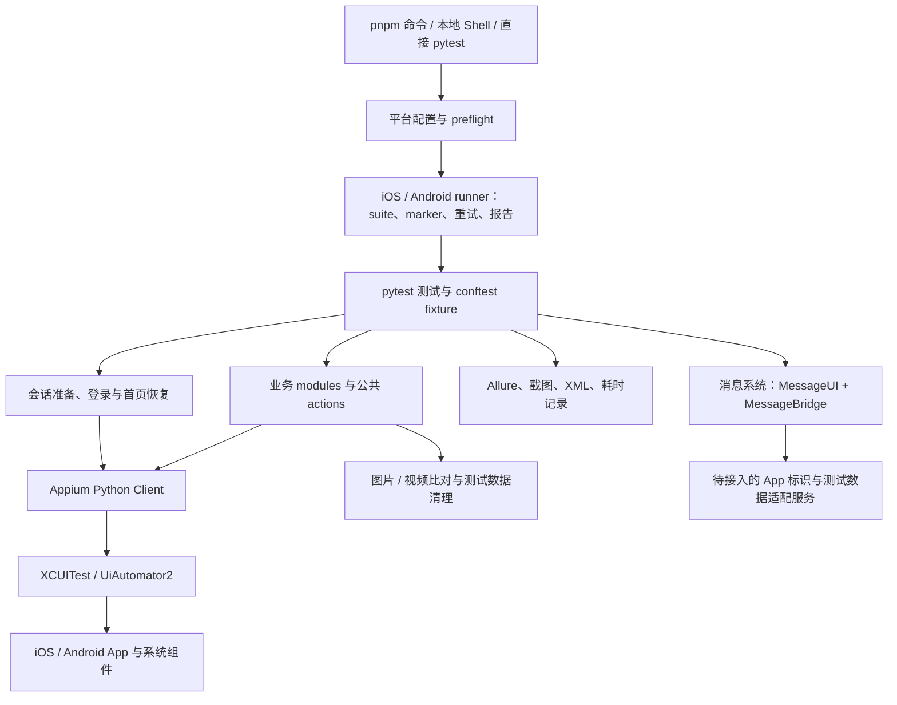
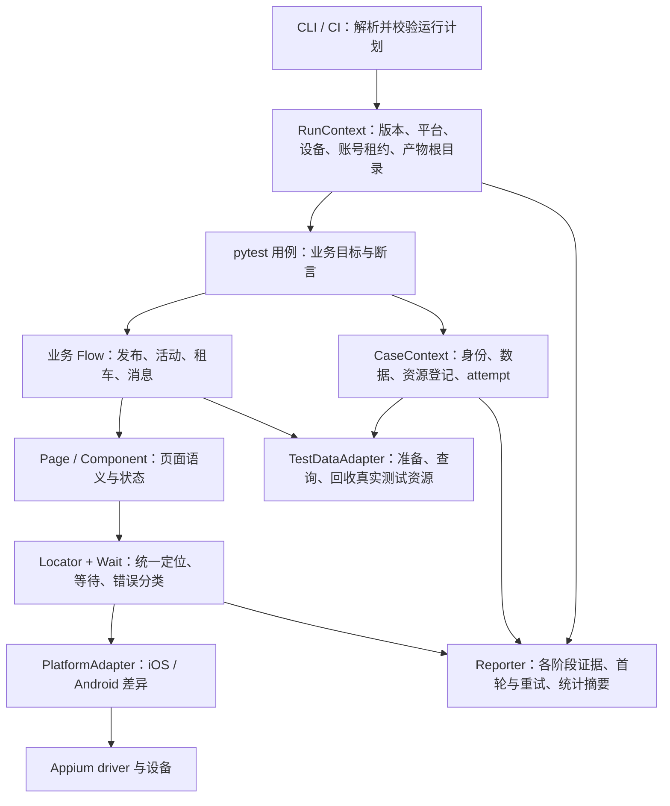

# Velowind App 自动化测试框架评估与改进方案

评估日期：2026-09-08  
评估基准：当前工作区，Git HEAD 为 `5058e87`；包含评估开始前已有的未提交修改和消息系统新增文件。  
评估方式：源码审阅、AST 统计、框架单元测试、pytest 用例收集与参数解析验证，以及官方文档核对。

## 1. 总体判断

这套框架已经具备较好的移动端自动化基础：能够组织 iOS / Android 流程，复用业务操作，处理真机环境问题，记录 Allure 步骤和失败证据，还具备图片、视频内容校验及 Bug 录制能力。它已经超出了简单的点击脚本集合。

当前主要短板集中在**测试结果的可信度、环境可复现性、状态与数据隔离，以及持续维护机制**。核心技术栈 Appium + pytest 可以继续使用。建议先修复框架自己的验证基线和执行语义，再逐步加强业务断言、数据管理和平台适配，最后扩展 CI 与多设备执行。

### 1.1 当前适用程度

| 使用场景 | 评估 | 原因 |
| --- | --- | --- |
| 熟悉项目的测试人员在固定设备上调试、回归 | 较适合 | 已有大量设备兼容逻辑、业务操作封装和排障资料 |
| 发布笔记、活动、租车等关键链路巡检 | 有基础，需明确前置条件 | 用例已经存在，但部分依赖现有账号数据、列表顺序和共享状态 |
| 新成员换电脑后直接复现同一轮测试 | 存在明显障碍 | 有个人绝对路径、明文默认凭据、全局工具依赖及失效的测试引用 |
| 无人值守的发布质量门禁 | 尚需补齐 | 默认 smoke 收集受单元测试导入错误影响；重试、跳过、清理与报告状态未形成统一门禁 |
| 多设备、多账号并发回归 | 尚未具备完整保障 | 只有部分端口配置能力，缺少设备独占、账号租约、数据和产物统一隔离 |
| 消息系统权限、收发与群管理验证 | 设计方向较好，仍待接入验证 | 已实现测试客户端与流程，但依赖 App 标识和测试数据适配服务，不能计为已验证业务覆盖 |

这里没有给出“稳定性 90 分”“覆盖率 80%”等分数：本次没有连续设备运行样本，也没有完整需求清单与用例映射，无法支持这样的量化结论。

### 1.2 最值得保留与最应优先解决的事项

**保留：** Appium / pytest 技术栈、suite 编排、公共业务操作、失败截图/XML、Allure、媒体比对、WDA 诊断、已验证的性能优化，以及消息系统的数据隔离设计。

**优先解决：** 完整单元测试无法收集、3 项已有测试失败、默认 smoke 被非业务测试阻断、重试参数被覆盖、full suite 存在隐式跳过、凭据与个人环境混入共享配置、清理规则过宽。

**随后建设：** 稳定定位契约、资源 ID 级别的数据准备与回收、明确的业务结果断言、统一故障分类和 run 级产物、自动化质量门禁。

## 2. 评估范围与证据边界

本次重点检查了 [项目命令入口][src-package]、[框架说明][src-readme]、两个平台的配置/driver/preflight/runner、公共 fixture、定位与会话管理、发布/活动/租车业务模块、清理、报告、录制、媒体校验和消息系统新增代码。

本次执行的是框架本地测试及仅收集用例的检查，未启动设备业务流程，也未调用业务接口创建、发布或删除测试数据。因此：

- 单元测试结果只说明本地框架逻辑的验证状态，不代表 App 业务通过。
- 用例能被收集，只说明导入和参数化等收集过程可完成，不代表其能在设备上正确执行。
- 文中的“风险”来自代码结构与行为分析；除特别说明外，不代表已在设备上复现。
- 仓库内已有性能报告属于历史记录，本次没有重新测量其耗时，也没有重新核验全部原始设备产物。
- 未在本仓库发现的 CI、服务端接口或团队流程，不等于团队在其他系统中没有这些能力。
- 本次交付为评估文档；建议项均未作为框架代码改动实施。

### 2.1 代码规模与测试规模

统计范围为 Appium 工程中的 Python 文件，包含当前未提交文件；不包含 `.venv`、生成报告和无关输出目录。行数包含注释与空行。

| 指标 | 本次统计 | 如何理解 |
| --- | ---: | --- |
| 工程 Python 文件 | 124 | 包含框架实现、测试和辅助代码 |
| `velowind_appium` 实现文件 | 53 | 合计 25,265 行 |
| 单元测试文件 | 40 | AST 识别到 896 个 `test_*` 函数定义，参数化后数量不同 |
| 非单元测试 `test_*` 函数定义 | 38 | 不等于独立业务需求数量 |
| 非单元测试收集结果 | 56 项 | 包含消息系统 13 项待接入场景、1 项录制生成用例 |
| YAML suite 文件 | 13 | 显式文件/方法引用的静态检查均通过 |
| 框架中 `time.sleep(...)` 调用点 | 281 | 很多是轮询间隔，不能直接视为 281 处错误等待 |
| 上述 sleep 的常量参数 ≥ 1 秒 | 10 处 | 说明不应把性能问题简单归因为“大量长 sleep” |
| `_safe_page_source(...)` 调用点 | 356 | 是静态调用点数，不是单次执行的页面树请求量 |
| 捕获 `WebDriverException` 的异常处理分支 | 467 | 其中有合理容错，也有需要保留底层错误的场景 |

最大的实现文件分别为：

| 模块 | 行数 | 当前承担的主要职责 |
| --- | ---: | --- |
| [message_detail.py][src-message-detail] | 5,783 | 发布、详情、评论互动、平台适配、媒体校验、产物等 |
| [activity_sessions.py][src-activity-sessions] | 2,673 | 场次导航、填写、选择、发布及兼容处理 |
| [activity.py][src-activity] | 2,611 | 活动发布及复杂编辑器操作 |
| [photo_picker.py][src-photo-picker] | 2,519 | 多平台、多系统相册与选图兼容 |
| [activity_browse.py][src-activity-browse] | 1,395 | 活动浏览、报名和个人列表 |
| [session.py][src-session] | 759 | 登录、首页恢复、弹窗处理、重启与平台分支 |

文件长度本身不是缺陷；真正的问题是职责聚集、修改影响面扩大，以及平台和业务规则交织。

### 2.2 本次执行结果

| 检查 | 结果 | 结论 |
| --- | --- | --- |
| 完整 `tests/unit-test` | 收集失败，退出码 2 | `test_regression_bug_helpers.py` 引用缺失的 `regression.taiga_critical_important` |
| 临时排除上述文件，再运行其余单元测试 | **926 passed，3 failed，1 warning，106.42 秒** | 当前完整框架验证基线未通过；排除仅用于诊断 |
| 非单元测试 `--collect-only` | 56 项，退出码 0 | 可完成收集，不代表设备通过 |
| 13 个 suite 的显式路径/方法检查 | 均存在 | YAML 中现存引用基本完整，但不能证明选择策略或前置条件正确 |
| iOS 发布笔记 suite 与直接指定同一方法分别收集 | 都是 1 项，退出码 0 | 本次未发现该 suite 多收集其他测试；不能仅凭命令带有根目录就认定会跑全量 |
| 默认 iOS smoke 的 pytest 收集命令 | 退出码 2 | `-m smoke` 仍受缺失 `regression` 模块的收集错误影响 |
| iOS / Android full suite 开启 runner 的 `run_all_failures` 后解析参数 | 最终 `maxfail=1` | 后出现的 suite 参数覆盖了 runner 的 `--maxfail=0` |

3 项失败均与 suite 测试有关：

1. [Android 活动发布 suite 测试][src-suite-unit-android] 把 `test-suites` **目录**传给 YAML 读取函数，触发 `IsADirectoryError`。
2. Android full suite 预期列表与当前 YAML 不一致。
3. [iOS full suite 测试][src-suite-unit-ios] 同样存在预期列表不一致。

后两项预期包含的 `test_user_can_open_activity_signup_form` 和 `test_user_can_view_my_activity_signup_status` 不在当前 full YAML 中，顺序也有差异。需要根据有效回归范围判断应补用例还是更新预期，不能直接删断言让测试变绿。

本机虚拟环境为 Python 3.9.6、pytest 8.4.2、Appium-Python-Client 5.3.1、Selenium 4.36.0、allure-pytest 2.15.2。运行提示 urllib3 与当前 LibreSSL 2.8.3 不兼容的警告；本次没有据此断言实际网络请求已失败。

## 3. 当前架构如何工作



整体已经有“测试编排—业务操作—设备驱动”的分层雏形。主要边界问题是：业务模块仍直接处理大量平台细节；driver 被附加业务状态；runner、fixture、报告与数据清理尚未共享一个完整的执行上下文。

## 4. 优点及其实际价值

### 4.1 跨平台投入能够复用

两端都采用 pytest 和 Appium Python Client，并已有平台独立配置和 driver 工厂。Android suite 复用了部分名称仍为 `test_ios_*` 的业务测试，说明业务步骤已经具备复用基础。[配置与 driver][src-config-ios]、[Android driver][src-driver-android]

收益是维护人员可以复用测试组织方式、报告和相当一部分业务逻辑。现阶段重点应放在明确平台边界，而不是更换语言或测试引擎。

### 4.2 框架自身已有较多验证资产

测试覆盖配置解析、动作封装、登录恢复、相册处理、媒体比对、清理和报告等逻辑；本次诊断子集有 926 项通过。对大量需要适配原生界面的代码而言，这些验证资产有助于渐进重构。

但很多测试依赖 fake driver 或 monkeypatch，能够证明特定输入下的逻辑行为，不能替代真实 App 的标识、可见性、时序和服务端状态验证。

### 4.3 环境排障能力比较实用

iOS 已有 WDA 启动错误识别、签名建议和诊断文件；Android 有设备在线、APK、Appium 服务及 driver 检查。本地脚本支持 Android Studio 模拟器、MuMu 和物理设备，并使用独立服务端口。[iOS preflight][src-preflight-ios]、[Android preflight][src-preflight-android]

这些能力应该保留并逐步标准化，减少环境问题被误判为产品缺陷。

### 4.4 已建立失败证据与步骤记录

公共 fixture 提供 `step`，记录步骤开始、成功、失败及耗时；失败可附加截图和 XML；Allure 原始结果与 HTML 已按 run ID 分目录。[公共 fixture][src-conftest]、[Allure 目录][src-allure-artifacts]

这使排障可以基于具体页面和执行阶段展开。后续应补齐 setup/teardown 证据和构建版本信息，而不是重新建立一套报告系统。

### 4.5 已有语义定位与条件等待的基础

`LocatorCandidate`、`wait_for_first`、`tap_first` 支持候选定位，超时报告逻辑控件名、尝试顺序和页面摘要。两端 driver 都关闭了隐式等待，便于使用显式等待控制流程。[定位层][src-actions]、[iOS driver][src-driver-ios]

已有模块也在复用同一轮页面快照、减少无效查询。这些思路可以推广，但应通过统一接口落实到新代码。

### 4.6 发布用例包含媒体内容验证

笔记发布实现会比较图片源与发布后的图片；视频流程在具备源素材时会采样比对实际画面。它能发现“发布成功但图片/视频选错或显示异常”等单纯按钮点击无法覆盖的问题。[发布流程][src-publish]、[图片校验][src-image-validation]、[视频校验][src-video-validation]

因此不能笼统评价为“所有用例都只看成功提示”。正确的改进方向是补足资源身份、持久化结果和媒体校验的适用边界。

### 4.7 已有性能测量与小范围优化经验

[2026-09-03 性能报告][src-performance-report]记录过 `ios-p1` 总耗时从约 43 分钟降到约 35 分钟，记录的当轮结果为 9 passed、4 skipped。该报告还记录了无收益方案的撤回，以及定位合并、快照复用、减少重复键盘操作的效果。

这是值得保留的工程实践。本次建议沿用“先测量、局部改造、比较结果”的方式；历史耗时不能直接作为当前版本、其他设备或全部业务的性能指标。

### 4.8 消息系统试点提供了可推广的设计

新增消息系统把测试数据、定位映射、UI 操作和业务流程分别组织；通过 run/case/variant 标识准备资源；在准备阶段前就安排清理；HTTP 写操作不隐式重试；业务流程同时检查 UI 和后端可观测状态。[消息 fixture][src-message-fixture]、[Bridge][src-message-bridge]、[消息流程][src-message-flows]

它还明确区分“服务端接受消息”和“接收端已同步”，并检查真实角色权限和拒绝操作后的状态不变。这比泛化的成功文案断言更接近业务验证。

目前这些仍是待接入的客户端和契约，应作为试点推进，不能算作已经完成真机验收的能力。[接入说明][src-message-readme]

## 5. 缺点、风险与具体改法

下文使用两类证据标签：**已确认**表示源码或本地执行可直接确认；**结构性风险**表示存在风险条件，实际发生率仍需设备样本验证。优先级 P0 为首先处理的基线/数据问题，P1 为影响结果可信度和维护效率的问题，P2 为后续规模化建设。

### 5.1 P0：框架验证基线不能完整运行

**已确认：** 缺失模块导致完整单元测试收集失败；诊断子集仍有 3 项失败。Appium 工程的 `pytest.ini` 的 `testpaths=tests` 又把框架单元测试与设备用例放在同一收集范围内，默认 smoke 即使按 marker 过滤也会受导入错误影响。[缺失引用][src-missing-import]、[pytest 配置][src-pytest]

**影响：** 难以分辨“框架真的可用”与“只跑了其中一部分”；普通设备 smoke 会被无关测试维护问题阻断。

**如何改进：**

1. 查明缺失的 regression 模块是遗漏提交、目录迁移还是已经废弃。恢复有效实现，或把仍需复用的 helper 迁入可导入的框架包并更新测试。
2. 修正目录误作 YAML 文件的测试；对两个 full suite 的差异逐项核对业务范围和稳定 case ID。
3. 为 unit、设备 E2E、录制草稿建立显式执行入口；将设备 fixture 放在设备测试作用域，避免所有单元测试通过 autouse 间接加载设备配置和写 Allure 环境文件。
4. suite 检查除了静态路径存在，还要使用真实 pytest 收集，核对选中的 node ID、参数组合、平台和执行条件。
5. 在 PR 中先接入“完整单元测试 + suite 收集”的必需检查。

**验收：** 全部单元测试无需临时 ignore 即可运行通过；默认 smoke 收集不导入框架单元测试；缺失 suite 文件或方法以明确错误退出；设备用例不在单元测试任务中执行。

### 5.2 P0：重试与 full suite 的执行语义不够可靠

**已确认问题 A：参数覆盖。** 两个 runner 都先添加 `--maxfail=0`，随后追加 suite 中的 `--maxfail=1`。本次实际解析后的值均为 1。[iOS runner][src-runner-ios]、[Android runner][src-runner-android]

开启失败重试后，首轮仍可能遇到第一个失败就退出；再使用 `--lf`，尚未执行的用例没有因此得到完整覆盖。如果重试通过，runner 又以第二轮退出码作为最终退出码，容易让调用方只看到成功。

**已确认问题 B：full 的名称与开关不同步。** `--all` 分支设置 `VW_IOS_RUN_FULL` / `VW_ANDROID_RUN_FULL`，但 `--suite-profile full` 和显式 full YAML 分支没有同等设置。两端底部 Tab 参数用例仍受这些变量的 `skipif` 控制。在外部未设置变量时，“选择了 full suite”并不保证这些用例实际执行。[iOS Tab 条件][src-ios-tab-skip]、[Android Tab 条件][src-android-tab-skip]

**已确认问题 C：失败缓存未按 run 隔离。** 当前 runner 使用 `--lf`，没有指定独立 `cache_dir`。pytest 的失败缓存跨调用保留，缓存缺失时 `--lf` 默认可执行全部选中测试；这需要明确控制。[pytest 官方失败缓存说明](https://docs.pytest.org/en/stable/how-to/cache.html)

**如何改进：**

- 先把配置解析为唯一的执行策略，再生成参数；为 maxfail、marker、报告、重试分别确定优先级，拒绝相互冲突的配置。
- 明确区分 `fail_fast` 调试模式与“完整执行后诊断重试”模式。重试优先使用本轮实际失败 node ID 清单，并记录未执行项；必要时保留同 run 的独立 pytest cache。
- 业务写操作默认不自动重试；确需重试时，先核对第一次操作是否已经成功，并使用新资源或受控幂等策略。
- 同时输出首次结果、重试结果和最终判定。关键用例首轮失败后重试通过，应记录为不稳定，是否放行由明确门禁策略决定。
- full 的执行范围、环境要求和允许 skip 原因写入 suite schema，由 runner 统一落实；所有“已选择但未执行”的项都进入摘要。

**验收：** 用一个本地隔离的三用例小套件模拟“先失败、再通过、最后尚未执行”，验证完整模式确实执行所有选中项，重试不误跑其他 run 的失败项；校验真实解析后的参数，不能只断言命令列表含有 `--maxfail=0`。

### 5.3 P0：共享配置包含明文凭据与个人机器路径

**已确认：** 被 Git 跟踪的 iOS/Android YAML 含有非空明文登录字段；Android 本地脚本提供硬编码登录默认值和某台 Mac 的 APK 路径。本文不复制具体账号和密码。[iOS YAML][src-ios-yaml]、[Android YAML][src-android-yaml]、[Android 本地脚本][src-android-shell]

**影响：** 团队共享代码与账号管理混在一起；不同机器可能使用同一个账号和不同 App 构建；配置问题容易在运行很久后才显现。

**如何改进：** 共享仓库保留无凭据的示例配置；账号密码由环境变量或 CI 的密钥机制注入；缺失时直接报出字段名。个人设备和构建路径放在忽略的本地配置，按“默认值 → 环境配置 → 本地配置 → 显式运行参数”确定唯一优先级。已提交的凭据按团队机制更换；若需处理 Git 历史，应作为独立协调事项。

**验收：** 新成员使用示例配置即可知道必填项；共享配置没有可直接使用的密码；报告、命令和诊断内容不输出凭据；运行摘要明确标识测试环境和 App 构建。

### 5.4 P0：数据清理的匹配范围过宽，回收没有统一归属

**已确认：** 批量清理的 `matches_test_data` 使用子串匹配；当前 `cleanup.yaml` 的活动匹配词包含非常宽泛的“活动”。清理具备 dry-run，这一点值得保留；但 dry-run 并不能使宽泛匹配自动变成精准匹配。[清理规则][src-cleanup-yaml]、[匹配函数][src-cleanup-config]

笔记成功后清理已开启，但在共享发布流程中发生于成功断言之后；部分清理未完成情况只附加说明，不改变测试结果。失败中途产生的数据不由这一成功路径保证回收。[发布后清理][src-shared-publish]

**结构性风险：** 在可见列表和匹配条件允许的范围内，批量清理可能触及非本次运行的数据；失败或中断可能留下笔记、评论、场次或订单，影响后续运行。

**如何改进：**

1. 优先移除共享规则中的泛化业务词；在完成资源归属机制前，只允许专用测试账号中的唯一测试前缀和明确时间范围。
2. 创建资源时登记 `run_id + case_id + account_id + resource_id`，按 ID 清理；不能仅依赖标题或列表第一项。
3. 通过 fixture/finalizer 绑定数据生命周期；准备操作超时也必须能按运行标识回收可能已创建的资源。
4. 区分产品断言失败与清理失败。清理失败单独记录 `cleanup_failed`，影响后续任务是否可复用该账号，不能悄悄消失。
5. 对长时间中断增加受控的过期资源回收，只处理登记为测试资源且超过 TTL 的记录。

pytest 提供 fixture teardown/finalizer 机制；建议将状态创建和对应清理一起封装，并处理准备阶段失败。[pytest 官方 fixture 文档](https://docs.pytest.org/en/stable/how-to/fixtures.html#safe-teardowns)

**验收：** 正常、断言失败、准备超时和中断恢复四类场景均能列出本轮资源及剩余资源；已有业务数据不出现在清理计划中；清理失败明确标注并可追踪。

### 5.5 P1：共享 driver 与页面恢复代替不了测试隔离

**已确认：** 公共 driver 为 session scope，默认 `noReset=true`；登录 fixture 在用例前准备状态，结束后按 marker 或环境开关恢复首页。业务实现还会通过 `setattr(driver, ...)` 保存源媒体、上传标题等信息。[公共 fixture][src-conftest]、[发布流程][src-publish]

这些选择降低了启动成本，适合连续调试。但回到首页不能恢复点赞、收藏、草稿、未支付订单、登录角色和服务端数据；driver 业务属性也可能跨用例保留。当前代码已专门处理拍摄视频误用上一条相册视频源的情况，说明团队已遇到并处理过此类边界。

**如何改进：** 保留 session 级设备连接，但新增 function 级 `CaseContext`，容纳账号、资源登记、媒体源、case 标识和清理结果。把“连接复用”“账号身份确认”“页面就绪”“业务数据隔离”分别管理；对退出登录、角色切换、支付和权限类场景使用独立会话或更强重置策略。

单独定义 `anonymous`、`authenticated_reader`、`publisher`、`owner`、`member` 等身份需求。身份应通过当前用户 ID 或明确的账号标识校验，不能仅看首页、发布入口或是否出现登录页面。消息系统的身份校验可以作为试点参考。

**验收：** 同一用例可单独、重复和改变顺序运行；状态互相干扰的场景至少做相邻组合验证；不存在从上一条用例继承的媒体预期或业务资源 ID。

### 5.6 P1：业务结果断言强弱不一致

**已确认：** 发布活动用例以成功/审核等信号作为最终断言；租车测试读取“最新未完成订单摘要”，校验字段完整；点赞收藏断言主要检查前后计数变化。笔记发布还包含图片/视频比对，消息系统则设计了更明确的 ID 与业务状态检查。[活动测试][src-activity-test]、[租车测试][src-rental-test]、[笔记互动测试][src-interaction-test]

**结构性风险：** 页面跳转或成功文案不能独立证明对应资源已经正确保存；字段完整不能证明读到的是本次订单；计数变化可能包含其他账号操作或已有状态反转。

**如何改进：** 对关键业务同时声明“动作对象、期望状态、可观测证据”。建议采用以下断言标准：

| 业务 | 建议验证的结果 |
| --- | --- |
| 发布笔记 | 唯一笔记 ID、作者、标题/正文、媒体关联、明确发布/审核状态；保留客户端媒体显示校验 |
| 发布活动 | 本次活动 ID、时间地点、费用、报名条件与保存后的关键字段 |
| 新增场次 | 明确活动 ID 下新增的场次 ID，日期、容量和价格一致，不误改旧场次 |
| 租车下单 | 本次订单 ID、门店/车辆/租期/金额、未支付状态及订单归属 |
| 点赞收藏 | 当前用户的目标资源状态按预期切换；必要时验证计数变化与基线一致 |
| 消息收发 | 消息 ID、发送者/会话、持久化恰好一次、接收端同步及 UI 显示 |

数据准备和结果查询可使用真实业务 API 的测试适配层；被测 UI 动作仍通过 App 执行。若 API 尚不可用，应使用唯一标识查找本次资源并重新进入详情验证，明确记录“仅 UI 可观测”的验证边界。

**验收：** 设计反例：成功提示出现但资源未保存、旧订单存在、新消息进入错误会话等，测试必须失败。不能由适配服务把预期值原样返回来证明正确。

### 5.7 P1：定位兼容积累较多，平台细节进入业务层

**已确认：** Android 的通用 `_test_id_locator` 实际返回匹配 `resource-id` 或 `content-desc` 的 XPath；模块中还存在绝对坐标、相对坐标、文本、XML 解析和平台分支。例如 Android 裁剪确认中包含固定像素点。[定位层][src-actions]、[裁剪兼容][src-crop-fallback]

Android driver 通过替换 `driver.execute_script`，把 iOS 风格的部分操作翻译为 Android 手势。它提供了务实的复用，但调用方无法直接看出真实使用的语义和平台约束。[Android driver][src-driver-android]

**如何改进：**

- 与 App 开发约定稳定且可测试的控件标识，同时约定 `visible`、`enabled`、实体 ID 和列表完成状态的表达方式。
- iOS 优先使用 accessibility ID；Android 明确区分 resource ID 和 content description，分别映射到原生 ID / accessibility 定位。RN 实际暴露值需要设备层验证，不能机械替换字符串。
- 官方 UiAutomator2 文档说明 `id`、accessibility 与 XPath 的映射方式不同；XPath 依赖页面树。优先语义标识是本项目的设计建议，实际性能收益需要测量。[UiAutomator2 官方定位说明](https://github.com/appium/appium-uiautomator2-driver#element-location)
- 坐标兼容集中到平台 adapter：标明适用系统/机型、必要前置状态、点击后的状态检查和废弃条件。App 自有控件优先补标识；系统相册等界面允许保留受控兼容。
- 用显式 `PlatformActions` 替代对 driver 方法的运行时改写，并逐步迁移，保留旧接口作为过渡。

**验收：** 每个新业务控件有统一定位入口；新增核心流程不散落裸坐标；兼容路径命中可统计；主标识缺失时给出明确诊断，不静默当作业务成功。

### 5.8 P1：等待和异常恢复缺乏统一预算与分类

`wait_for_first` 已有总 deadline，这是优势。但候选查找会捕获包括 `WebDriverException` 在内的错误继续尝试；部分 `_safe_page_source` 把异常转换为空字符串。业务层又有自己的轮询、重启和恢复逻辑。[通用等待][src-actions]、[页面树容错][src-page-source]

**结构性风险：** 会话断开、Appium 服务异常和“元素暂时不存在”可能最终都表现为定位超时；外层 timeout 不能中断已经阻塞的远程命令；嵌套等待可能使一个标为 20 秒的操作实际超过预期。

**如何改进：**

1. 区分定位暂不可用、页面未就绪、会话失效、传输失败、产品断言失败和清理失败。只对明确可恢复的错误做有限重试，保留异常链。
2. 统一等待 API，显式区分存在、可见、可点击和业务完成。当前通用 `tap_first` 的查找主要证明存在，不应在所有控件上直接等同可点击。
3. 为页面动作与整条 case 设置预算；内层等待使用剩余时间。远程调用还需配置合理的 transport/driver 超时与外层执行超时，不能只依赖 Python 循环的 deadline。
4. 快照只在同一观察阶段共享；发生点击、滚动、切页后重新获取。对列表总数、上传完成等状态优先采用明确标识或业务查询。
5. 结构化记录耗时、定位候选命中、XML 次数与恢复次数，先优化 P95 热点，再调等待间隔。

**验收：** 模拟 session lost 时快速给出基础设施错误；可选元素缺失正常返回；必需元素缺失保留定位诊断；验证远程调用较慢和嵌套等待时的预算行为。

### 5.9 P1：失败证据只覆盖部分阶段，产物目录尚未统一

**已确认：** 两套 `pytest_runtest_makereport` 都对非 `call` 阶段提前返回，因此 setup 的登录/数据准备失败、teardown 的清理失败可能没有同等截图/XML。消息系统说明也明确提到这一限制。[公共 hook][src-conftest]、[Android hook][src-android-conftest]

Allure 已按 run ID 隔离，但普通截图配置默认仍指向平台级目录；部分发布媒体产物默认写到另一个目录。`timestamped_path` 只有秒级时间与 label，同秒同名可能覆盖。runner 的报告函数还会直接 `Popen(allure open ...)`，不检查 `VW_APPIUM_AUTO_OPEN_REPORT=false`，与共享 reporting helper 行为不同。[产物命名][src-artifacts]、[媒体产物目录][src-media-artifacts]、[runner][src-runner-ios]

**如何改进：**

- 统一 run 上下文，所有证据按 run / platform / worker / case / attempt / phase 归档，文件名使用 UUID 或足够唯一的序号。
- setup、call、teardown 三阶段失败均采证；如果 driver 尚未创建或已失效，则保留会话创建错误、配置摘要和 Appium/WDA/adb 日志，不强行截图。
- 采证失败不能覆盖原始失败；保留采证错误作为附属诊断。
- 分离 `generate_report` 与 `open_report`。CI 生成和上传报告，本地按开关打开浏览器；报告生成失败也应显示在摘要中。
- 增加 App 构建号/哈希、Git SHA、dirty 状态、后端环境、测试数据版本、工具版本和设备信息；凭据脱敏。
- 明确证据保留期限与访问范围，避免截图/XML 中账号资料或消息正文被无控制共享。

**验收：** 人为触发三个阶段的失败，均能找到对应证据或明确的不可采集原因；重复尝试不会覆盖首轮证据；关闭自动打开开关时不启动 Allure 预览进程。

### 5.10 P1：模块职责集中，重构成本会继续增加

**已确认：** 最大业务文件达 5,783 行，多个模块在 2,500 行以上；iOS/Android runner 和 fixture 有相近实现；配置读取也有重复逻辑。共享测试文件仍大量保留 iOS 命名，公共配置 fixture 也名为 `ios_config`，即使实际运行 Android。

**如何改进：** 按职责拆分，不仅按文件长度切割。推荐顺序为“纯解析/校验 → 媒体处理 → 定位映射 → 平台动作 → 业务流程”；公共 runner 统一 suite、重试和报告策略，平台入口只提供配置和启动差异。

保留现有公开函数作为薄兼容层，例如旧 `publish_message_note` 委托给新发布流程。每次迁移一个业务域，使用现有单元测试加少量真实设备契约验证，避免一次性重写全部模块。

**验收：** 纯解析和校验不依赖真实 driver；业务流程不直接判断系统坐标；每个模块的职责可以用一句话说明；新旧接口的外部行为一致，关键流程设备验证通过。

### 5.11 P1：框架测试存在源码写入与实现细节耦合

**已确认：** `test_generate_test_module_writes_bug_mode_recording_without_module_name` 只把录制输入放在临时目录，却未指定输出目录，调用生成器默认路径，实际改写被 Git 跟踪的 `tests/generated/test_artifact.py`。本次单元测试产生的这一行路径变化已恢复。[生成器测试][src-generator-test]、[生成器默认输出][src-generator]

该生成文件又位于 pytest 测试树，包含支付相关按钮操作。它属于录制草稿，不应因为位于测试树中就自动成为已审核的回归用例。现有 `manual_recording` marker 也未在当前 `pytest.ini` 中登记。

此外，runner 的测试能证明参数列表包含某项，却没有发现真实参数解析后被覆盖的问题；full suite 测试直接比较完整有序列表，也容易把顺序调整和业务范围变化混成同一种失败。

**如何改进：** 所有生成输出使用 `tmp_path` 或 monkeypatch 临时根目录；录制草稿移出默认回归收集范围；补充生成结果语法、关键断言和无副作用检查。为 runner 增加真实 parser / 子进程收集级测试，为 suite 用稳定 case ID 验证必需项和禁止项，仅在顺序确属契约时验证顺序。

**验收：** 单元测试前后被跟踪文件的状态不变；录制生成物必须经过断言补全和设备验证才能加入正式 suite；参数冲突、空选择和错误平台有自动化验证。

### 5.12 P2：工具链锁定、CI、覆盖矩阵与并发治理不足

**已确认：** Python requirements 已固定大部分直接依赖，这是基础保障；但没有完整传递依赖锁文件，`setuptools` 只限制上界，Selenium / urllib3 版本由依赖解析决定。README 使用全局安装 Appium 和 driver 的方式，未固定整个工具链。[依赖][src-requirements]

本仓库未发现已跟踪的 CI 工作流、Python 打包配置、统一 lint/type 检查配置或设备资源调度机制。README 的目录介绍也落后于当前业务范围；部分脚本别名引用不存在的脚本名称。这里的结论仅限本仓库。

**如何改进：** 锁定经过验证的 Python、依赖、Node/pnpm、Appium server、driver、Allure CLI 和平台工具组合；使用兼容性验证后的升级流程。Appium server 与 driver 的主版本可能有兼容约束，不能把分别安装“最新版”视为可复现环境。[UiAutomator2 官方要求](https://github.com/appium/appium-uiautomator2-driver#requirements)

先接入不需要设备的 PR 检查，再在受控主机执行设备 smoke；建立需求—case ID—平台—执行状态矩阵。多设备并发放在账号、设备和产物隔离之后推进，详见第 7 节。

## 6. 建议的目标架构

目标是把现有能力放到明确的职责边界内，并让执行策略、数据、状态和产物围绕同一个运行上下文协作。



### 6.1 各层应该负责什么

| 层 | 应负责 | 应避免承担 |
| --- | --- | --- |
| Runner | 配置解析、选择用例、执行预算、重试策略、退出状态 | 页面点击、业务断言 |
| RunContext | 运行 ID、构建信息、设备/账号资源、统一产物路径 | 把密码写入序列化报告 |
| CaseContext | 单例输入、资源 ID、媒体源、attempt、清理结果 | 把这些信息临时塞进共享 driver |
| Test | 表达业务场景、调用流程、判断期望结果 | 分散编写 XPath、坐标和系统版本判断 |
| Flow | 多页面业务流程与明确结果对象 | 隐藏重试非幂等提交、吞掉关键失败 |
| Page / Component | 控件语义、页面状态、页面内操作 | 管理整个测试会话和环境 |
| PlatformAdapter | Appium 能力、系统相册/键盘/手势差异 | 定义“订单正确”“消息已送达”等业务判断 |
| TestDataAdapter | 调用真实服务准备数据、查询结果、回收资源 | 直接返回测试期望、绕过待测用户权限 |
| Reporter | 结构化证据、阶段状态、版本信息、趋势 | 将重试后的通过覆盖首轮失败事实 |

不要求每一个按钮都新建类。对简单页面可保留函数模块；对共享组件、复杂页面和跨平台系统操作再引入对象边界。重构应降低理解成本，而不是增加模板代码。

### 6.2 建议目录方向

以下是未来目录示意，不是已经实施的目录迁移：

```text
appium/
├── pyproject.toml
├── config/                 # 无凭据的示例、环境与设备配置
├── test-suites/            # 明确平台、范围和执行条件
├── velowind_appium/
│   ├── core/               # config、context、runner、wait、reporter
│   ├── platforms/          # ios、android、系统组件适配
│   ├── pages/              # App 页面和公共组件
│   ├── flows/              # 发布、活动、租车、消息业务流程
│   ├── data/               # 测试数据适配与资源登记
│   └── validation/         # 纯解析、图片和视频校验
├── tests/
│   ├── unit/               # 框架单元测试，不依赖设备配置
│   ├── contract/           # 配置、收集、adapter 与 App 标识契约
│   └── e2e/                # 正式设备回归与设备 fixture
└── recording-drafts/       # 默认不收集，审核后进入 e2e
```

现有测试目录可以先不迁移，通过显式入口和 fixture 作用域实现第一步隔离。目录重命名应安排在基线通过后，避免同时引入大量 import 和 suite 路径变化。

## 7. 如何分领域落地

### 7.1 用发布笔记作为第一个完整试点

发布笔记已经有数据参数化、跨平台复用、媒体校验和清理路径，适合证明新边界是否有效。

推荐按以下顺序实施：

1. **记录基线。** 固定 App 构建、设备、账号、素材和后台环境；记录首次结果、步骤耗时、恢复次数、清理状态。
2. **明确输入。** 为一次用例生成唯一业务标识；记录素材文件校验值。媒体库的“第 1 张”只能作为选取实现，不能充当预期素材身份。
3. **准备身份和数据。** 确认指定账号；初始化运行资源登记；在可能创建数据前安排失败后的回收。
4. **迁移页面语义。** 先抽取发布页、媒体选择组件和笔记详情页，保持旧公开函数兼容。
5. **返回结果对象。** Flow 返回本次笔记的身份与最终可观测状态，避免只返回一个泛化成功字符串。
6. **补充业务断言。** 通过独立查询或重新进入详情检查内容与状态，保留媒体显示比对。
7. **验证反例与恢复。** 模拟资源未持久化、媒体不匹配、提交结果未知、清理失败，确保输出可判读。
8. **小范围设备验收。** 同一平台重复执行及不同顺序运行，再推广到另一平台；结果稳定后迁移活动和订单。

以下仅表达未来测试接口的形态，其中 `data_api` 和结果字段需要团队根据真实接口实现：

```python
def test_publish_note(case_context, publish_flow, data_api):
    draft = case_context.make_unique_note(media_fixture="known-image")
    published = publish_flow.publish(draft)

    saved = data_api.wait_note(published.note_id, state="pending_review")
    assert saved.author_id == case_context.actor_id
    assert saved.title == draft.title
    assert saved.body == draft.body
    publish_flow.assert_displayed_media_matches(draft.media)
```

这里的审核状态必须匹配实际产品规则；示例中的 `pending_review` 不是对现有后端枚举的声明。资源登记与 finalizer 应由上下文/fixture 提供，即使 `publish` 超时未返回 ID，也能通过运行标识识别和回收潜在资源。

### 7.2 对复杂场景采用不同的准备策略

| 场景 | 建议前置条件 | 特别需要验证 |
| --- | --- | --- |
| 只读首页/搜索 | 固定可查询内容、允许的登录状态 | 空态、结果归属和筛选规则，不只检查页面出现 |
| 发布/编辑 | 独立测试账号、唯一资源标识、固定素材 | 保存后字段、重复提交、失败后残留 |
| 活动报名 | 已发布的指定活动与场次、已知名额和身份状态 | 已报名/未报名、容量、时间边界、重复报名 |
| 租车订单 | 固定车辆与门店、测试库存和价格、隔离账号 | 订单 ID、金额明细、未支付/取消状态和资源回收 |
| 登录/退出/权限 | 独立身份与状态策略 | 避免自动登录 fixture 掩盖被测登录流程；权限拒绝是否真的无副作用 |
| 系统相册/相机/权限弹窗 | 明确系统版本、素材与权限 profile | 允许/拒绝/部分授权分别验证，不能全部自动允许后宣称覆盖权限场景 |
| 消息与群管理 | 不同角色账号、真实数据适配与同步可观测性 | 真正接收、排序、未读数、权限拒绝和清理 |

租车和支付相关测试应使用明确的测试环境与测试支付能力。本次未验证真实支付成功、回调、退款或费用计算，不应把“进入支付页并退出”计作完整支付覆盖。

### 7.3 把媒体校验的边界说明白

当前视频比对为实际采样帧寻找最相似的源帧，再根据平均分判断。它适合检查画面是否与源素材一致，但独立的最佳帧匹配不能充分证明播放顺序、播放进度或没有冻结；截图采样也不能验证声音。[视频比较实现][src-video-validation]

建议把指标拆为三个层面：

- **素材正确性：** 预期源素材明确，主要画面与实际一致；不同素材作为负样本。
- **播放行为：** 非静态测试素材的时间/画面确实推进；检查卡顿、重复帧和中途停止；时序校验使用允许转码误差的规则。
- **媒体完整性：** 需要时另行检查时长、方向、分辨率变化和音频轨道；允许的裁剪/转码属于产品契约。

阈值应使用正确转码、裁剪、错图、黑屏、冻结等正负样本校准。不能仅因某个相似度阈值能使当前样例通过，就认定它具有稳定的缺陷检出能力。

### 7.4 建立分层验证，而不是无限增加 UI 路径

| 验证层 | 适合覆盖 | 执行位置 |
| --- | --- | --- |
| 框架单元测试 | 配置、定位表达式、页面解析、错误分类、清理计划、媒体算法 | 每个框架 PR，无设备 |
| 框架集成/契约检查 | runner 实际参数、pytest 收集、标识映射、数据适配请求/响应 | PR 与集成环境；需要设备的子集单独标识 |
| App 组件/状态逻辑测试 | 表单规则、纯状态转换、组件边界 | App 源码仓库，由对应开发流程承担 |
| API / 服务业务验证 | 价格、容量、权限、幂等、状态流转及边界组合 | 后端/接口测试任务，与本框架共享 case ID |
| 设备 UI smoke | 关键入口、登录、核心页面和少量代表性交易链路 | 稳定构建后，在固定设备池运行 |
| 设备完整回归 | 系统能力、复杂交互、主要业务组合、跨平台差异 | 夜间、发布前或按风险触发 |

不能把 926 项框架单元测试算成 App 的 926 个业务测试。也不应为了提高“自动化数量”，把原本应在 API 层验证的大量规则都堆成昂贵的 UI 场景。

### 7.5 先建立串行 CI，再引入设备并发

建议初期采用三类任务：

1. **PR 快速任务：** 完整框架单元测试、suite 收集检查、生成物检查、增量 lint/type 检查。任务结束后验证没有新增源码改动。
2. **构建 smoke：** 获取明确构建，运行 preflight 和关键 smoke，失败也上传全部阶段证据；检查必需用例是否被跳过。
3. **夜间/发布回归：** 固定设备矩阵运行完整套件，生成历史指标，输出产品失败、环境失败、未执行和不稳定用例。

设备任务需要匹配平台条件的受控执行主机，特别是 iOS 的 Xcode/WDA/设备管理。现有本地 preflight 可演进成“检查工具版本 → 检查目标设备 → 检查服务/driver → 检查 App 构建 → 检查账号/素材条件”的分层检查。先报告阻塞原因，再决定是否创建 driver。

多设备并发前需要准备：

- 一台设备在一个时刻只被一个任务占用；设备租约支持超时释放和异常后健康检查。
- 每个 worker 使用独立账号或明确可并发的测试身份、数据命名空间及资源登记。
- Android 分配独立 `systemPort`；涉及 WebView、录屏时，按实际能力分配相关端口。[UiAutomator2 官方并发说明](https://github.com/appium/appium-uiautomator2-driver#parallel-tests)
- iOS 分配独立设备 UDID、`wdaLocalPort`、必要的构建缓存路径和录屏端口。[XCUITest 官方并发说明](https://appium.github.io/appium-xcuitest-driver/latest/guides/parallel-tests/)
- worker 分别写产物，结束后由一个汇总任务生成报告，避免争用 `latest-report`。

当前消息系统明确要求串行执行，不能直接给它加 xdist。先完成资源隔离和真实并发验证，再考虑放开该限制。初期采用独立设备任务即可，不必先搭建大型设备农场。

### 7.6 延续 Allure，补上历史与指标

当前 run 目录隔离值得保留。新增汇总器应存储本轮原始尝试、失败分类和执行清单，并延续历史；Allure 2 与 Allure 3 的历史保存机制不同，应先固定 CLI 版本再实现。官方说明区分跨运行历史与同一测试的 retries。[Allure 官方历史与重试文档](https://allurereport.org/docs/history-and-retries/)

结果应至少区分：

| 状态 | 含义 | 对后续运行的意义 |
| --- | --- | --- |
| passed | 首轮完成并满足断言 | 可作为稳定通过样本 |
| product_failed | 业务断言失败，具有对应证据 | 阻止相应范围放行，进入缺陷处理 |
| infra_failed | 服务、设备、会话、构建或环境失败 | 需要修复环境，不能等同产品失败或业务通过 |
| flaky | 首轮失败，受控重试通过 | 保留首次证据，进入稳定性治理 |
| blocked/skipped | 未满足接入或场景前置条件，未验证业务 | 必需场景不能因跳过而被算作发布通过 |
| not_run | fail-fast、中断等导致未执行 | 显式显示覆盖缺口 |
| cleanup_failed | 本例资源未按约定回收 | 标记账号/环境是否还可安全复用 |

这些可以是汇总层的分类，不必强行修改 pytest 的原生结果枚举。

## 8. 分阶段实施计划

以下为粗略工作量估计，便于安排顺序，不是承诺交付时间。以一名熟悉框架的维护者持续投入、App 和后端按需配合为前提；人日不包含等待接口、构建和设备排期的时间。

| 阶段 | 优先任务与交付物 | 建议负责人 | 粗估工作量 | 完成标准 |
| --- | --- | --- | --- | --- |
| A：恢复可信基线 | 修复缺失导入和 3 项失败；隔离 unit/E2E/录制；修复 maxfail/full 开关；去除默认凭据；收紧清理规则；统一报告打开开关 | 自动化维护者，账号负责人配合 | 4–7 人日 | 完整单测通过，默认入口收集正确，执行策略可验证，运行不改源码 |
| B：完善诊断与状态 | setup/call/teardown 采证；RunContext/CaseContext 最小实现；统一产物路径和首轮/重试摘要；建立基线采样 | 自动化维护者 | 5–8 人日 | 每次失败可定位阶段、版本、case 与 attempt；共享状态有明确归属 |
| C：改造一个业务闭环 | 发布笔记试点；稳定标识；唯一资源与数据准备/清理；持久化断言；平台动作适配 | 自动化 + App + 后端 | 8–15 人日 | 试点能单独、连续、变序运行；反例能检出；资源可回收 |
| D：推广并接入 CI | 活动/订单逐域迁移；消息适配服务与 App 标识接入；PR 检查和串行设备 smoke；覆盖矩阵 | 自动化 + 相关开发 | 10–20 人日，取决于接口现状 | 新增用例执行同一规范，关键用例无隐式 skip，报告有历史数据 |
| E：扩展执行规模 | 工具链升级流程、设备/账号租约、两设备并发试点、长期不稳定用例治理 | 自动化 + 平台支持 | 5–10 人日起 | 并发结果与串行一致，端口/账号/产物不冲突 |

B、C、D 可有部分工作交错进行，但先后依赖应保持：**完整基线 → 明确数据与状态边界 → 核心业务试点 → CI 扩展 → 并发。**

### 8.1 如果短期只能投入一周

优先交付以下内容：

1. 恢复完整单元测试运行，解释并处理 suite 范围差异。
2. 修复默认 smoke 收集、重试参数覆盖和 full 的隐式跳过。
3. 修正生成器单元测试写入源码的问题，隔离录制草稿。
4. 移除共享默认凭据，收紧批量清理匹配范围。
5. 统一报告打开开关，输出选中、执行、失败、跳过、未执行的摘要。

这一阶段优先提升结果可信度。大型模块全面拆分、多设备并发和新增大量业务用例可以后排。

### 8.2 将任务拆成可评审的小变更

推荐每个变更只解决一个完整问题，例如：

- “修复 suite 参数优先级”：包含策略解析、真实 parser 测试、兼容说明。
- “统一失败阶段采证”：包含三阶段处理、driver 不可用分支、不会覆盖原异常的验证。
- “发布笔记资源隔离”：包含唯一输入、资源登记、失败后清理、业务查询与反例验证。
- “Android 定位适配”：包含原生标识映射、设备样本、fallback 诊断与旧接口兼容。

不要把文件搬家、等待策略变化、业务断言变更和用例扩充混在同一个大改动里，否则很难判断回归来自哪里。

## 9. 用什么指标判断改进有效

先为固定设备、App 构建、后端环境和 suite 建立基线。可以先做每个平台关键 smoke 连续 20 次的短期采样，再持续滚动观察；20 次只能用于发现明显问题，不能充分证明 99% 等高可靠性水平。

| 指标 | 建议口径 | 初期验收方向 |
| --- | --- | --- |
| 完整框架基线 | 完整单测与 suite 校验结果 | 必须通过，无临时 ignore |
| 执行完整率 | 本轮已执行的必需用例数 / 本轮选中的必需用例数 | 发布所需场景达到 100%，skip 和 not_run 单列 |
| 首轮通过率 | 无重试即通过数 / 实际执行数 | 保留全口径，同时按失败类别拆分，先看持续趋势 |
| 不稳定率 | 首轮失败且受控重试通过的用例数 / 实际执行数 | 建立责任人与修复时限，避免靠重试掩盖 |
| P50 / P95 耗时 | 按 suite、case、setup、业务动作、cleanup 分类 | 试点可把 P95 降低 20% 作为暂定目标，前提是断言与执行范围不缩水 |
| 恢复/兼容路径占比 | 发生重启、备用定位、坐标兼容的 case 或动作占比 | 先测量，再逐步降低高频业务控件的兼容依赖 |
| 失败证据完整率 | 有阶段、版本、日志与可用页面证据的失败数 / 失败总数 | 每次失败有证据或不可采集原因 |
| 数据回收率 | 已回收登记资源数 / 应回收资源数 | 发布门禁运行零未解释残留；无法回收要明确阻塞 |
| 需求有效覆盖率 | 已实现、已接入且在要求平台验证的需求数 / 范围内需求总数 | 使用需求矩阵；不以函数数、参数数或 CSV 人工标记代替 |
| 维护成本 | 新增一条有效用例和修复定位故障的实际耗时 | 按同类场景比较，检查抽象是否真正降低成本 |

现有 [QA 工作量报告模块][src-qa-report]可以继续作为需求覆盖和缺陷统计入口，但人工标注的“已覆盖”应与可执行 case ID、平台和最近验证结果关联。不要把历史统计、当前代码存在与当前实际通过混为一项指标。

## 10. 下一轮需要确认的信息

这些信息不影响本次评估结论，但会决定后续实施细节和工作量：

| 信息 | 决定什么 |
| --- | --- |
| 是否已有独立测试环境、账号池和真实数据准备接口 | 数据隔离与清理能否快速落地 |
| App 可补充哪些测试标识与页面 ready/identity 状态 | 哪些坐标和 XML 兼容可先替换 |
| 当前支持的 iOS/Android 版本、屏幕和相册实现 | 平台适配与设备矩阵范围 |
| 哪些业务必须作为发布阻断项 | smoke/full 范围与 skip 门禁 |
| 是否在其他仓库或平台已有 CI、API/组件测试 | 如何复用，避免重复建设 |
| 消息测试适配服务是否已有负责人和真实业务数据来源 | 13 项场景从待接入到实际验收的计划 |
| 不同测试数据的清理权限、保留时间与恢复方式 | 资源登记、TTL 回收和事故恢复边界 |

## 11. 复核方式与本地证据

### 11.1 可复现的本地命令

以下是本次评估使用的核心命令。从本项目根目录执行；第二条的 ignore 仅用于继续诊断现有问题，不是推荐的正式运行方式。

```bash
PYTHONPATH=apps/velowind-app/appium VW_APPIUM_AUTO_OPEN_REPORT=false \
  .venv/bin/python -m pytest apps/velowind-app/appium/tests/unit-test -q --tb=short

PYTHONPATH=apps/velowind-app/appium VW_APPIUM_AUTO_OPEN_REPORT=false \
  .venv/bin/python -m pytest apps/velowind-app/appium/tests/unit-test \
  --ignore=apps/velowind-app/appium/tests/unit-test/test_regression_bug_helpers.py \
  -q --tb=short

PYTHONPATH=apps/velowind-app/appium .venv/bin/python -m pytest \
  apps/velowind-app/appium/tests --collect-only -q \
  --ignore=apps/velowind-app/appium/tests/unit-test
```

当前生成器单元测试会写入仓库生成文件，重新执行时应在隔离 checkout 中运行，或在修复该测试输出目录后执行。本次已恢复该项测试造成的变动。既有业务代码修改保持原状。

参数冲突检查使用两个 runner 的 `build_pytest_command(..., run_all_failures=True)` 构建 full suite 命令，再用 pytest 实际配置解析器读取 `maxfail`，得到的都是 1。本次没有为验证这一问题启动真实设备流程。

### 11.2 运行日志

这些日志保存在本机被忽略的临时目录中；核心结果已完整写入本文，其他成员无需持有这些临时文件也可以理解结论。

- [完整单元测试收集错误][log-unit]
- [诊断子集：926 passed / 3 failed][log-unit-subset]
- [设备用例收集：56 项][log-device]
- [默认 smoke 收集错误][log-smoke]
- [发布笔记 suite 收集][log-suite]
- [直接指定发布方法收集][log-direct]

外部参考均来自 pytest、Appium、Allure 官方文档，查阅日期为 2026-09-08。官方最新文档用于核对设计方向，具体能力仍应按团队最终固定的 server、driver 和 CLI 版本验证。

[src-package]: /Users/test/Documents/velowind-app-dev-test/package.json:1
[src-readme]: /Users/test/Documents/velowind-app-dev-test/apps/velowind-app/appium/README.md:1
[src-message-detail]: /Users/test/Documents/velowind-app-dev-test/apps/velowind-app/appium/velowind_appium/modules/message_detail.py:1
[src-activity-sessions]: /Users/test/Documents/velowind-app-dev-test/apps/velowind-app/appium/velowind_appium/modules/activity_sessions.py:1
[src-activity]: /Users/test/Documents/velowind-app-dev-test/apps/velowind-app/appium/velowind_appium/modules/activity.py:1
[src-photo-picker]: /Users/test/Documents/velowind-app-dev-test/apps/velowind-app/appium/velowind_appium/modules/photo_picker.py:1
[src-activity-browse]: /Users/test/Documents/velowind-app-dev-test/apps/velowind-app/appium/velowind_appium/modules/activity_browse.py:1
[src-session]: /Users/test/Documents/velowind-app-dev-test/apps/velowind-app/appium/velowind_appium/session.py:112
[src-suite-unit-android]: /Users/test/Documents/velowind-app-dev-test/apps/velowind-app/appium/tests/unit-test/test_run_android_tests.py:167
[src-suite-unit-ios]: /Users/test/Documents/velowind-app-dev-test/apps/velowind-app/appium/tests/unit-test/test_run_ios_tests.py:188
[src-config-ios]: /Users/test/Documents/velowind-app-dev-test/apps/velowind-app/appium/velowind_appium/config.py:17
[src-driver-android]: /Users/test/Documents/velowind-app-dev-test/apps/velowind-app/appium/velowind_appium/android_driver.py:8
[src-driver-ios]: /Users/test/Documents/velowind-app-dev-test/apps/velowind-app/appium/velowind_appium/driver.py:10
[src-preflight-ios]: /Users/test/Documents/velowind-app-dev-test/apps/velowind-app/appium/velowind_appium/preflight.py:257
[src-preflight-android]: /Users/test/Documents/velowind-app-dev-test/apps/velowind-app/appium/velowind_appium/android_preflight.py:73
[src-conftest]: /Users/test/Documents/velowind-app-dev-test/apps/velowind-app/appium/tests/conftest.py:1
[src-allure-artifacts]: /Users/test/Documents/velowind-app-dev-test/apps/velowind-app/appium/velowind_appium/allure_artifacts.py:35
[src-actions]: /Users/test/Documents/velowind-app-dev-test/apps/velowind-app/appium/velowind_appium/actions.py:74
[src-publish]: /Users/test/Documents/velowind-app-dev-test/apps/velowind-app/appium/velowind_appium/modules/message_detail.py:400
[src-image-validation]: /Users/test/Documents/velowind-app-dev-test/apps/velowind-app/appium/velowind_appium/image_validation.py:35
[src-video-validation]: /Users/test/Documents/velowind-app-dev-test/apps/velowind-app/appium/velowind_appium/video_validation.py:126
[src-performance-report]: /Users/test/Documents/velowind-app-dev-test/apps/velowind-app/appium/performance-optimization-report-20260903.md:1
[src-message-fixture]: /Users/test/Documents/velowind-app-dev-test/apps/velowind-app/appium/tests/message_system/conftest.py:45
[src-message-bridge]: /Users/test/Documents/velowind-app-dev-test/apps/velowind-app/appium/velowind_appium/message_system/bridge.py:20
[src-message-flows]: /Users/test/Documents/velowind-app-dev-test/apps/velowind-app/appium/velowind_appium/message_system/flows.py:5
[src-message-readme]: /Users/test/Documents/velowind-app-dev-test/apps/velowind-app/appium/tests/message_system/README.md:1
[src-missing-import]: /Users/test/Documents/velowind-app-dev-test/apps/velowind-app/appium/tests/unit-test/test_regression_bug_helpers.py:3
[src-pytest]: /Users/test/Documents/velowind-app-dev-test/apps/velowind-app/appium/pytest.ini:1
[src-runner-ios]: /Users/test/Documents/velowind-app-dev-test/apps/velowind-app/appium/velowind_appium/run_ios_tests.py:148
[src-runner-android]: /Users/test/Documents/velowind-app-dev-test/apps/velowind-app/appium/velowind_appium/run_android_tests.py:149
[src-ios-tab-skip]: /Users/test/Documents/velowind-app-dev-test/apps/velowind-app/appium/tests/smoke/test_ios_feature_walkthrough.py:109
[src-android-tab-skip]: /Users/test/Documents/velowind-app-dev-test/apps/velowind-app/appium/tests/android_smoke/test_android_feature_walkthrough.py:287
[src-ios-yaml]: /Users/test/Documents/velowind-app-dev-test/apps/velowind-app/appium/ios-appium.yaml:5
[src-android-yaml]: /Users/test/Documents/velowind-app-dev-test/apps/velowind-app/appium/android-appium.yaml:20
[src-android-shell]: /Users/test/Documents/velowind-app-dev-test/scripts/appium-android-local.sh:61
[src-cleanup-yaml]: /Users/test/Documents/velowind-app-dev-test/apps/velowind-app/appium/cleanup.yaml:1
[src-cleanup-config]: /Users/test/Documents/velowind-app-dev-test/apps/velowind-app/appium/velowind_appium/cleanup_config.py:39
[src-shared-publish]: /Users/test/Documents/velowind-app-dev-test/apps/velowind-app/appium/tests/shared_publish_note.py:48
[src-activity-test]: /Users/test/Documents/velowind-app-dev-test/apps/velowind-app/appium/tests/activity/test_publish_activity.py:9
[src-rental-test]: /Users/test/Documents/velowind-app-dev-test/apps/velowind-app/appium/tests/rental/test_rental_order.py:25
[src-interaction-test]: /Users/test/Documents/velowind-app-dev-test/apps/velowind-app/appium/tests/message/test_ios_home_note_interactions.py:72
[src-crop-fallback]: /Users/test/Documents/velowind-app-dev-test/apps/velowind-app/appium/velowind_appium/modules/message_detail.py:2110
[src-page-source]: /Users/test/Documents/velowind-app-dev-test/apps/velowind-app/appium/velowind_appium/modules/message_detail.py:5109
[src-android-conftest]: /Users/test/Documents/velowind-app-dev-test/apps/velowind-app/appium/tests/android_smoke/conftest.py:120
[src-artifacts]: /Users/test/Documents/velowind-app-dev-test/apps/velowind-app/appium/velowind_appium/artifacts.py:16
[src-media-artifacts]: /Users/test/Documents/velowind-app-dev-test/apps/velowind-app/appium/velowind_appium/modules/message_detail.py:2830
[src-generator-test]: /Users/test/Documents/velowind-app-dev-test/apps/velowind-app/appium/tests/unit-test/test_ios_manual_recording.py:175
[src-generator]: /Users/test/Documents/velowind-app-dev-test/apps/velowind-app/appium/velowind_appium/generate_ios_test_from_recording.py:228
[src-requirements]: /Users/test/Documents/velowind-app-dev-test/apps/velowind-app/appium/requirements.txt:1
[src-qa-report]: /Users/test/Documents/velowind-app-dev-test/apps/velowind-app/appium/velowind_appium/qa_workload_report.py:1
[log-unit]: /Users/test/Documents/velowind-app-dev-test/.tmp/framework-assessment-20260908/unit-tests.log:1
[log-unit-subset]: /Users/test/Documents/velowind-app-dev-test/.tmp/framework-assessment-20260908/unit-tests-subset.log:1
[log-device]: /Users/test/Documents/velowind-app-dev-test/.tmp/framework-assessment-20260908/device-collection.log:1
[log-smoke]: /Users/test/Documents/velowind-app-dev-test/.tmp/framework-assessment-20260908/default-smoke-collection.log:1
[log-suite]: /Users/test/Documents/velowind-app-dev-test/.tmp/framework-assessment-20260908/runner_suite.log:1
[log-direct]: /Users/test/Documents/velowind-app-dev-test/.tmp/framework-assessment-20260908/explicit_suite_only.log:1
